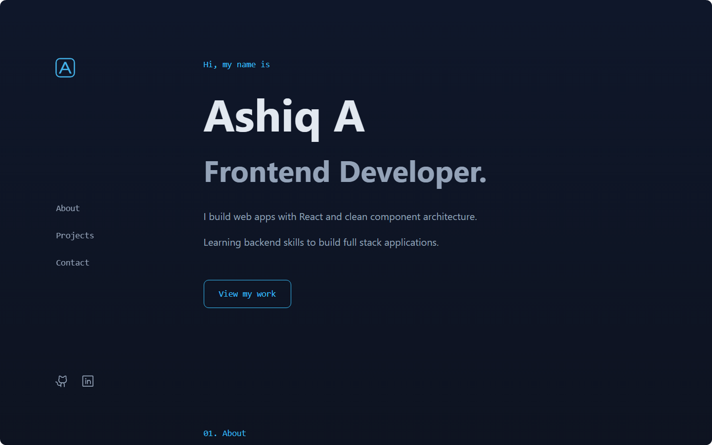

# Portfolio Site

A single-page scroll developer portfolio built with React 19, Vite and Tailwind CSS v4. Left sidebar navigation on desktop, hamburger menu on mobile and project detail pages with dynamic routes.

Live site: <!-- live-url -->



## Features

- Single-page scroll layout with hash anchor navigation
- Scroll-spy sidebar that highlights the active section as you scroll
- Mobile hamburger menu with gradient overlay
- Project detail pages using React Router dynamic routes
- Hover-dimming effect on project cards (other cards fade when one is hovered)
- Dark-only theme with a sky-blue accent palette
- Custom Tailwind `@theme` tokens for site-wide color consistency
- CSS-driven hover effects using `hover:` and `group-hover:` variants
- Responsive layout tested across mobile and desktop breakpoints
- 69 component tests across 11 test files

## Tech Stack

| Category | Technology |
|---|---|
| Framework | React 19 |
| Build Tool | Vite |
| Language | TypeScript |
| Styling | Tailwind CSS v4 |
| Routing | React Router |
| Animation | Motion |
| Icons | Phosphor Icons |
| Testing | Vitest, Testing Library, jsdom |
| Linter | ESLint |

## Color Palette

| Token | Hex | Usage |
|---|---|---|
| `accent` | `#38bdf8` | Links, active states, hover effects |
| `heading` | `#e2e8f0` | Headings and titles |
| `body` | `#94a3b8` | Body text and descriptions |
| `card-border` | `#262626` | Project card borders |

Background: `linear-gradient(180deg, #0f172a 0%, #0a0a0a 100%)`

## Getting Started

### Prerequisites

- Node.js 22 or higher

### Installation

```bash
git clone https://github.com/ashiq-webdev/portfolio-site.git
cd portfolio-site
npm install
```

### Development

```bash
npm run dev
```

Vite prints the local URL in your terminal. Open that URL in your browser.

### Build

```bash
npm run build
```

The build output lands in `dist/`.

### Preview Production Build

```bash
npm run preview
```

### Run Tests

```bash
npm run test
```

## Project Structure

```
src/
  components/
    Layout/
      Layout.tsx           # Shell wrapping Sidebar + Outlet + Footer
      Sidebar.tsx          # Nav links, scroll-spy, hamburger menu
    Home/
      Hero.tsx             # Name and pitch
      About.tsx            # Bio and skills grid
      ProjectsGrid.tsx     # Project cards with hover-dimming
      Contact.tsx          # Email CTA
      Footer.tsx           # Tech credits and social icons
    SocialIcons.tsx        # GitHub and LinkedIn links
  pages/
    HomePage.tsx           # Composes Hero, About, ProjectsGrid, Contact
    ProjectDetailPage.tsx   # Case study with Overview, Tech, Features, Lessons
    NotFoundPage.tsx       # 404 page
  utils/
    projects.ts            # Shared project data for grid and detail page
  index.css                # Tailwind @theme tokens and global styles
setupTests.js              # IntersectionObserver mock for jsdom
```

## Key Design Decisions

**Dark-only theme.** A theme toggle adds complexity and bugs for no portfolio value. The site uses a single dark palette with a sky-blue accent color (#38bdf8).

**Tailwind `@theme` tokens.** Custom colors are defined as CSS custom properties inside `@theme` in `index.css`. Tailwind generates `text-accent`, `bg-accent/10`, `border-accent/50` and all opacity variants from these tokens. No inline styles or JavaScript color values.

**CSS-driven hover effects.** All hover states use `hover:` and `group-hover:` Tailwind variants in CSS. No JavaScript event handlers for styling.

**`<a href>` for project cards.** Project cards use native anchor tags, not React Router `Link`. This forces a full page reload on navigation, which resets scroll position on the detail page.

**Footer in Layout.** The footer renders once in `Layout.tsx` after the `<Outlet>`, so every page including the 404 gets it. No per-page duplication.

**IntersectionObserver mock.** `setupTests.js` mocks `IntersectionObserver` with no-op methods because jsdom does not implement it. Without the mock, every Sidebar test crashes.

## Testing

The test suite covers 11 components and pages with 69 tests:

- Content rendering: headings, paragraphs, links, alt text
- Interactive elements: hamburger toggle, nav links, mailto links, project card links
- Conditional rendering: project found, not found, in progress
- Composition: HomePage section rendering, Layout structure

Tests are co-located next to their components (`Hero.test.tsx` next to `Hero.tsx`).

## License

[MIT](LICENSE)